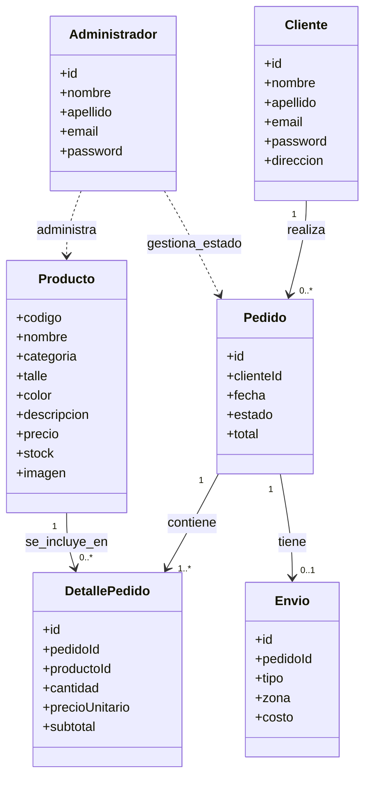

# Diagrama de clases (modelo de dominio)

> Negocio: **Sistema de Gestión de Ventas para OCN Villa Urquiza** (venta de indumentaria urbana de marca propia).
> Basado en `Proyecto de Desarrollo de Sistema.docx`.



## Estados de `Pedido`

```text
Pendiente → Confirmado → En preparación → Enviado → Finalizado
Pendiente → Cancelado (estado alternativo, sólo desde Pendiente)
```

## Reglas de negocio identificadas (para etapas futuras)

- RN-01: no se vende si `stock == 0`.
- RN-02: `email` único por cliente.
- RN-03: cancelación de pedido sólo en estado `Pendiente`.
- RN-04: envío gratuito si el total supera el mínimo definido por el administrador.
- RN-05: si el administrador cambia el precio con el producto en el carrito, se actualiza antes de confirmar la compra.

## Métodos previstos (solo guía, no implementados en esta etapa)

En esta etapa **no se implementan métodos ni lógica de negocio**, sólo se documentan como referencia para el futuro:

- Cliente: registrarse(), iniciarSesion(), editarDatos()
- Administrador: crearProducto(), editarProducto(), eliminarProducto(), actualizarStock(), cambiarEstadoPedido()
- Producto: actualizarPrecio(), actualizarStock()
- Pedido: confirmar(), cancelar(), calcularTotal()
- DetallePedido: calcularSubtotal()
- Envio: calcularCosto()
